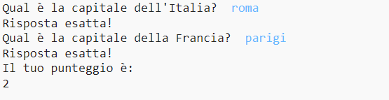
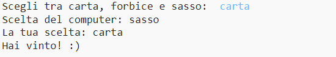
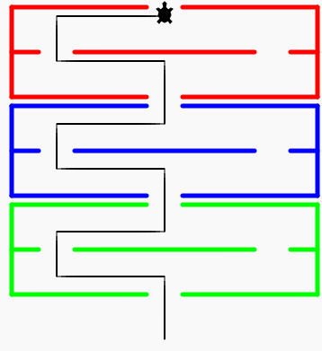
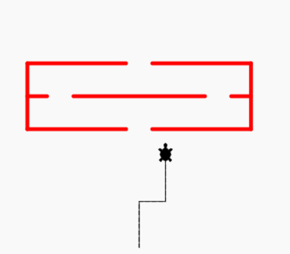
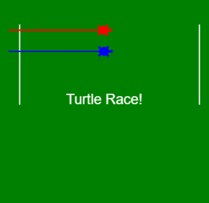
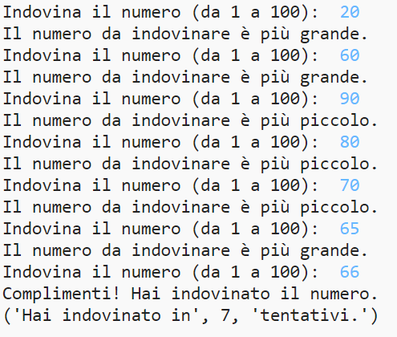

# Lezioni

[//]: # (## Concetti di Teoria)

[//]: # (- [Input e Output]&#40;/lezioni/lezione1/input-output&#41;)

[//]: # (- [Variabili]&#40;/lezioni/lezione1/variabili&#41;)

[//]: # (- [Input]&#40;/lezioni/lezione1/input&#41;)

[//]: # (- [Condizioni 1]&#40;/lezioni/lezione1/condizioni&#41;)

[//]: # (- [Grafica]&#40;/lezioni/lezione4/turtle&#41;)

## Progetti

### 1. Quiz
Pagina del progetto [qui](/lezioni/lezione1/progetto1-2).

### 2. Carta forbice sasso
Pagina del progetto [qui](/lezioni/lezione2/progetto2-2).

### 3. Labirinto 1
Pagina del progetto [qui](/lezioni/lezione4/labirinto-1).

### 4. Labirinto 2
Pagina del progetto [qui](/lezioni/lezione4/labirinto-2).

### 5. Gara di Tartarughe
Pagina del progetto [qui](/lezioni/lezione5/gara-1).

### 6. Indovina il numero
Pagina del progetto [qui](/lezioni/lezione7/indovina-numero).
