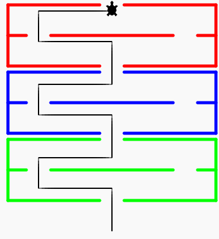

# 🎮 Labirinto - 1

Ora che sappiamo come far muovere la tartaruga, possiamo farle attraversare un labirinto.

## Prepariamo il programma

Andiamo sul sito [trinket.io/turtle](https://trinket.io/turtle) e creiamo un nuovo file chiamato `labirinto.py`.
Nel nuovo file incolliamo il seguente codice:

```python:line-numbers
import turtle

screen = turtle.Screen()
screen.tracer(0)

mazeWidth=150

myMaze = turtle.Turtle()
myMaze.width(5)
myMaze.hideturtle()

myMaze.speed(0)

myMaze.penup()
myMaze.goto(-mazeWidth,190)


def drawMazeSection(color):
  myMaze.color(color)
  myMaze.pendown()
  myMaze.forward(mazeWidth)
  myMaze.penup()
  myMaze.forward(40)
  myMaze.pendown()
  myMaze.forward(mazeWidth)
  myMaze.right(90)
  myMaze.forward(100)
  myMaze.right(90)
  myMaze.forward(mazeWidth)
  myMaze.penup()
  myMaze.forward(40)
  myMaze.pendown()
  myMaze.forward(mazeWidth)
  myMaze.right(90)
  myMaze.forward(100)
  myMaze.right(90)
  x,y = myMaze.pos()
  myMaze.penup()  
  myMaze.goto(x, y-50)
  myMaze.pendown()
  myMaze.forward(30)
  myMaze.penup()
  myMaze.forward(40)
  myMaze.pendown()
  myMaze.forward(200)
  myMaze.penup()
  myMaze.forward(40)
  myMaze.pendown()
  myMaze.forward(30)
  myMaze.penup()
  myMaze.goto(x,y-110)

for color in ["#FF0000","#0000FF","#00FF00"]:
  drawMazeSection(color)

screen.tracer(1)    
```

Torniamo sul file `main.py` e incolliamo quanto segue:

```python:line-numbers
import turtle
import labirinto

tartaruga = turtle.Turtle()
tartaruga.speed(0)
tartaruga.shape('turtle')
tartaruga.penup()
tartaruga.goto(20,-180)
tartaruga.pendown()
tartaruga.left(90)
tartaruga.speed(3)

# Inizia da qui sotto:

```

## 🧩 Esercizio

Scrivi un programma che faccia attraversare il labirinto alla tartaruga.



