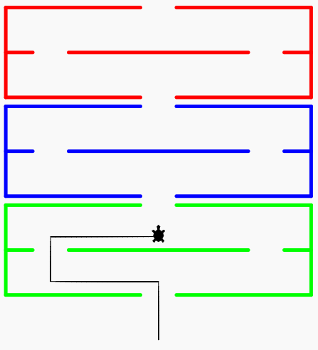
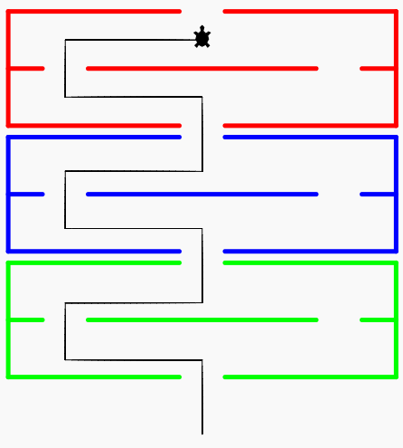
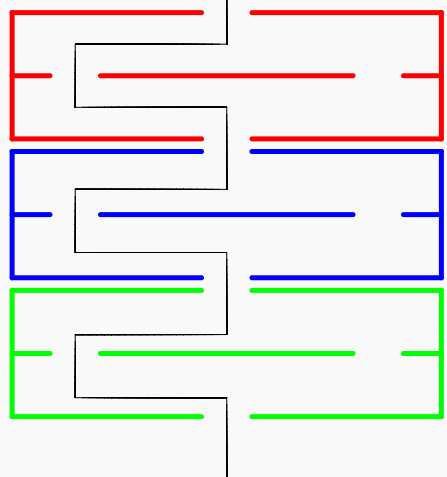
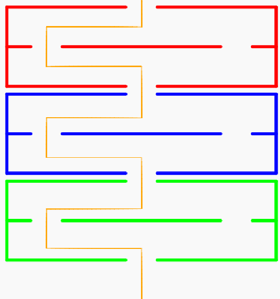
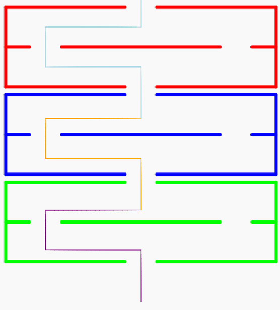
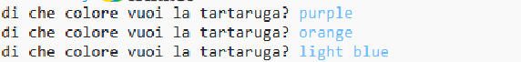

# 🎮 Labirinto - 2

Abbiamo visto che possiamo far ripetere alla tartaruga le stesse istruzioni più volte usando un ciclo for.

Nel labirinto che abbiamo disegnato, le tre parti del labirinto (verde, blu e rossa) sono identiche e per superare
ciascuna parte servono le stesse istruzioni.

Possiamo dunque usare un ciclo for per evitare di ripetere lo stesso codice tre volte.

## Superare la prima sezione del labirinto

Per prima cosa troviamo le istruzioni che servono alla tartaruga per superare la parte verde del labirinto:

```python
tartaruga.forward(65)
tartaruga.left(90)
tartaruga.forward(120)
tartaruga.right(90)
tartaruga.forward(50)
tartaruga.right(90)
tartaruga.forward(120)
tartaruga.left(90)
```



## Ripetere le istruzioni

Ora che abbiamo le istruzioni per superare la prima parte del labirinto, possiamo usare un ciclo for per ripeterle tre
volte.

```python
for i in range(3):
  tartaruga.forward(65)
  tartaruga.left(90)
  tartaruga.forward(120)
  tartaruga.right(90)
  tartaruga.forward(50)
  tartaruga.right(90)
  tartaruga.forward(120)
  tartaruga.left(90)
```



## Fare uscire la tartaruga dal labirinto

Per far uscire la tartaruga dal labirinto, dobbiamo farla andare dritta ancora una volta, fino alla fine.

Questa istruzione va aggiunta dopo il ciclo for, perchè non vogliamo che venga ripetuta ogni volta che la tartaruga
supera una parte del labirinto ma solo alla fine.

```python
for i in range(3):
  tartaruga.forward(65)
  tartaruga.left(90)
  tartaruga.forward(120)
  tartaruga.right(90)
  tartaruga.forward(50)
  tartaruga.right(90)
  tartaruga.forward(120)
  tartaruga.left(90)
  
tartaruga.forward(65)
```



## Scegliere il colore della tartaruga

Possiamo cambiare il colore della tartaruga usando la funzione `color`.

Per esempio, per far diventare la tartaruga rossa possiamo scrivere:

```python
tartaruga.color("red")
```

Per far diventare la tartaruga verde possiamo scrivere:

```python
tartaruga.color("green")
```

e così via.

### 🧩 Esercizio

Scrivi un programma che chieda all'utente il colore della tartaruga prima di farle attraversare il labirinto.



### 🧩 Esercizio

Scrivi un programma che chieda all'utente il colore della tartaruga ogni volta che la tartaruga supera una parte del
labirinto.



