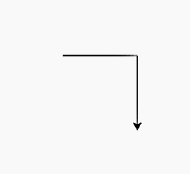

# 📐 Grafica

In questa lezione iniziamo con la grafica. Per fare grafica in Python possiamo usare la funzionalità `turtle`.
Si chiama così perché tramite il codice si può controllare una "tartaruga" che disegna sullo schermo la sua "scia".


[//]: # (- Forme base)

[//]: # (- Colori tartaruga)

[//]: # (- Labirinto)

[//]: # (- Disegnare l'iniziale del vostro nome)

[//]: # (- Disegnare una bandiera)

## Come funziona?

Per prima cosa dobbiamo dire a python di usare "_turtle graphics_". Per fare questo scriviamo:

```python:line-numbers
import turtle
```

Dopodiché dobbiamo creare la tartaruga. Per fare questo scriviamo:

```python
tartaruga = turtle.Turtle()
```

Una volta che abbiamo creato la tartaruga la possiamo far muovere. Per fare questo possiamo ad esempio dirgli di andare
avanti di
un certo numero di passi:

```python
tartaruga.forward(100)
```

Se vogliamo farla girare di 90 gradi a destra, possiamo scrivere:

```python
tartaruga.right(90)
```

E se facciamo andare la tartaruga avanti di altri 100 passi si crea un angolo.

```python
tartaruga.forward(100)
```



### 🧩 Esercizio

Scrivi un programma che faccia disegnare alla tartaruga un quadrato.


### 🧩 Esercizio

Scrivi un programma che faccia disegnare alla tartaruga un triangolo.


## Forme base

Oltre a `forward` e `right`, ci sono altre funzioni che possiamo usare per far muovere la tartaruga. Ad esempio,
possiamo farla girare di 90 gradi a sinistra:

```python
tartaruga.left(90)
```

Oppure possiamo farla andare alla posizione iniziale in centro allo schermo:

```python
tartaruga.home()
```

Inoltre la tartaruga conosce già come disegnare alcune forme, come i cerchi. Per disegnare un cerchio di raggio 100
possiamo scrivere:

```python
tartaruga.circle(100)
```

Queste istruzioni possono essere combinate per creare disegni più complessi.

### 🧩 Esercizio

Scrivi un programma che faccia disegnare alla tartaruga un cerchio sopra un quadrato.


## Colori

Possiamo anche cambiare il colore della tartaruga e del pennello. Per fare questo possiamo usare i seguenti comandi:

```python
tartaruga.color("red")
```

Alcuni colori sono:

- `red`
- `green`
- `blue`
- `black`
- `purple`
- `yellow`
- `orange`

### 🧩 Esercizio

Scrivi un programma che faccia disegnare alla tartaruga un quadrato con ciascun lato di un colore diverso.


### 🧩 Esercizio

Scrivi un programma che faccia disegnare alla tartaruga un cerchio di raggio 90, un cerchio di raggio 60 e un cerchio di
raggio 30, ciascuno di un colore diverso.

